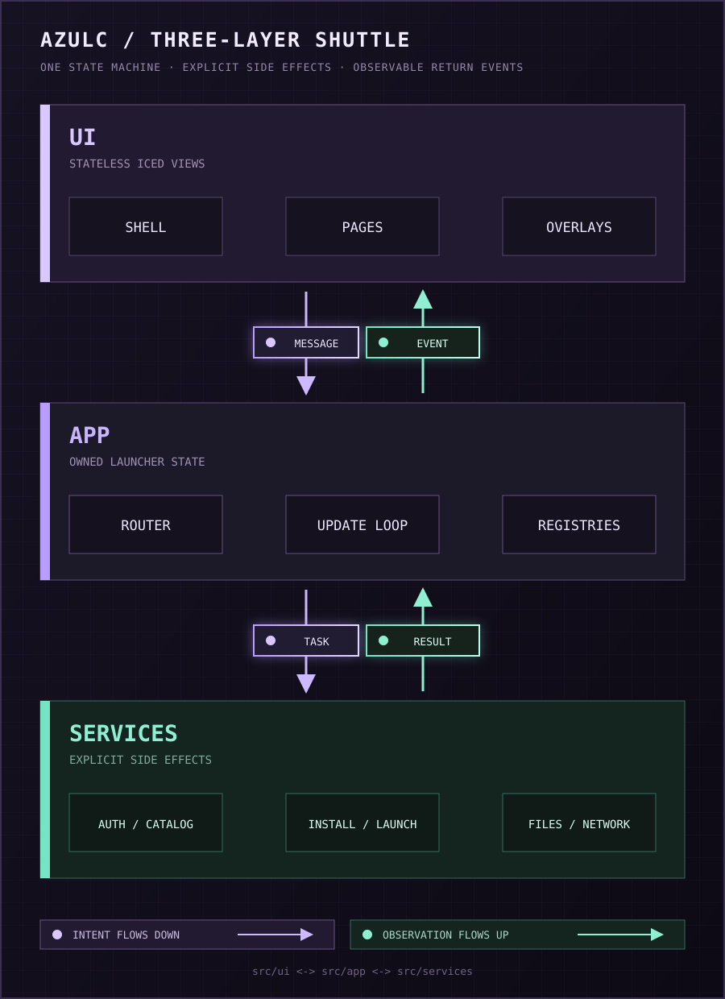

# Azusa Minecraft Launcher

Azusa Minecraft Launcher (AZULC) is a next-generation lightweight, high-performance Minecraft launcher and technology validation platform. It is native and all-Rust, built with Iced around a borderless English pixel interface, isolated instances, and one observable state machine for the complete Minecraft + mod-loader installation flow.

## Current features

- Multiple Microsoft accounts through device-code OAuth.
- Minecraft release, snapshot, legacy, and April Fools catalogs.
- Vanilla, Fabric, Forge, and NeoForge installation.
- Live compatible loader-build catalogs with source-aware fallback and automatic selection of the newest stable build.
- Configurable official and mirror download routes with parallel transfers.
- Java discovery and automatic or per-instance runtime selection.
- Per-instance worlds, mods, resource packs, screenshots, settings, and play-time telemetry.
- CurseForge and Modrinth modpack discovery plus local CurseForge, Modrinth, and MultiMC/Prism archive import.
- Per-instance CurseForge and Modrinth downloads for mods, resource packs, shaders, and data packs, including required dependencies.
- Concurrent per-instance launch monitoring with independent readiness, live logs, failure reporting, and open-log actions.
- A cancellable and retryable install pipeline with live stage, file, byte, speed, and processor output.

## Run

Rust 1.88 or newer is required.

```powershell
cargo run
```

Copy `.env.example` to `.env` and configure the required credentials:

```dotenv
AZULC_CURSEFORGE_API_KEY='<your approved key>'
AZULC_MICROSOFT_CLIENT_ID='<Azusa Minecraft Launcher application client ID>'
```

AZULC loads `.env` automatically. Process-level environment variables take precedence.

Build an optimized binary:

```powershell
cargo build --release
```

Application data uses the operating system's application-data location. On Windows this is normally `%APPDATA%\AZULC\AZULC`:

```text
minecraft/                shared versions, libraries, assets, and installers
instances/<uuid>/         isolated game directories, content, and launch logs
state.json                accounts/tokens, instances, download policy, and settings
```

## Architecture

AZULC is split into three layers. The UI describes what is shown, the app layer owns
state and coordinates events, and services perform filesystem, network, installation,
and process work.

<p align="center">
  
</p>

### UI

The UI is a set of stateless Iced views. Pages read `Launcher` state and emit typed
`Message` values; they do not perform I/O directly.

```text
src/ui/
├── mod.rs                  route-to-view dispatch and overlay composition
├── shell/                  title bar, sidebar, and resize frame
├── overlays/               delete confirmation and launch authentication
├── components/             shared icons, media, catalog, layout, and avatars
├── instance/               overview, content, settings, and install activity
├── wizard/                 Minecraft version, loader, and details steps
├── modpacks/               online discovery and local archive import
├── resource_browser/       project search and compatible file selection
├── settings/               downloads, Java, and about pages
├── home.rs                 dashboard
├── accounts.rs             account management
└── brand.rs                application and window artwork
```

### App

The app layer owns mutable launcher state, validates stale asynchronous results, and
routes every user or service event through the root update loop.

```text
src/app/
├── mod.rs                  Launcher state, startup tasks, and subscriptions
├── message.rs              typed events shared by views and operations
├── update.rs               root event dispatch and route transitions
├── navigation.rs           routes, tabs, filters, and wizard steps
├── install/
│   ├── mod.rs              install jobs, attempts, retries, and pipeline events
│   ├── wizard.rs           new-instance draft and loader catalog orchestration
│   └── modpacks.rs         online and local modpack install requests
├── instance/               instance editing and resource-browser orchestration
├── launch/                 authentication and concurrent launch sessions
├── accounts.rs             Microsoft account state transitions
├── bootstrap.rs            startup catalog and repair tasks
└── thumbnails.rs           thumbnail request tracking and caching
```

### Services

Services contain side-effecting and provider-specific work. They accept explicit
inputs, return domain values or errors, and remain independent of UI navigation.

```text
src/services/
├── auth/                   Microsoft OAuth, token validation, and profile retrieval
├── catalog/                provider-neutral projects, releases, and install plans
├── providers/              CurseForge and Modrinth protocol clients and DTOs
├── download/               mirrors, bounded transfers, hashes, and atomic writes
├── installer.rs            continuous loader-aware installation pipeline
├── launcher.rs             JVM arguments, natives, process output, and readiness
├── minecraft.rs            metadata, planning, verification, and base downloads
├── loader_catalog.rs       compatible Fabric, Forge, and NeoForge builds
├── modpack.rs              safe archive inspection, manifests, and overrides
├── content.rs              local instance-content scanning
├── insights.rs             dashboard aggregation and service health
├── java.rs                 Java discovery and runtime selection
├── thumbnail.rs            trusted thumbnail loading and decoding
├── path_safety.rs          portable path and filename validation
├── shell.rs                operating-system file reveal helpers
└── system_resources.rs     CPU and memory discovery
```

`src/domain.rs` defines the serializable models shared across the layers, while
`src/storage.rs` owns application paths and persisted launcher state.

An install does not poll disconnected "download" and "install" jobs. Each stage awaits the preceding future:

```text
resolve Minecraft metadata
  → plan and verify all base files
  → resolve and download the loader
  → write Fabric metadata or run Forge-family processors
  → download verified modpack content and apply overrides
  → finalize the isolated instance
  → complete
```

Every transition emits a `PipelineEvent` into the same root subscription. Cancelling drops that future; Forge-family child processes use `kill_on_drop`. Retrying rebuilds the plan and reuses files that already pass verification.

## Acknowledgements

- [SJMCL](https://mc.sjtu.cn/sjmcl/) — source-code and implementation reference.
- [BMCLAPI](https://bmclapidoc.bangbang93.com/) — Minecraft download mirror provider.

## License

Azusa Minecraft Launcher is licensed under GPL-3.0-or-later.
